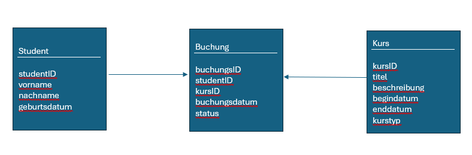

# Dokumentation JDBC DAO Aufgabe 3 - 5

### Video 1 - 5 vom JDBC Dao Kurs durchgearbeitet

Eine Datenbankverbindung im Singleton Pattern erstellt, damit man die Verbindung während der Laufzeit nur einmal herstellen kann. Ist die Verbindung bereits hergestellt worden, wird die vorherige Verbindung weitergegeben, ansonsten wird eine neue erstellt.

Die Benutzeroberfläche wird über ein Kommandozeilen Interface CLI (Command Line Interface) geregelt und dieses läuft immer wieder in einer Schleife bis man es dementsprechend per Nutzereingabe beendet.

Die abstrakte Klasse BaseEntity ist die Basisklasse für alle Entitäten in einer Datenbank. Diese hat immer eine Id.

Die Klasse Course erbt von BaseEntity und hat noch weitere Datenfelder für die jeweiligen Tabellenfelder.
Eines dieser Felder ist der Kursstyp für den eine Enumeration CourseType erstellt wurde.

### Video 6 DAO Interfaces Video

Es wurde ein Interface BaseRepository erstellt. Dieses dient als Bauplan für alle DAOs die später erstellt werden. In diesem sind bestimmte Methoden definiert auf Basis von CRUD:
-insert
-getById
-getAll
-update
-deleteById

Dieses Interface hat zwei generische Typen die die Methoden benutzen. In diese generischen Typen wird bei einer Vererbung von einer anderen Klasse bestimmte Typen festgelegt, die benutzt werden.

Das MyCourseRepository ist ein DAO für die Klasse Course, die es ebenfalls als Tabelle in der Datenbank gibt. Diese Klasse erbt von BaseRepository und vergibt für die beiden generischen Typen die Klassen Course und Long. Zusätzlich werden weitere Methoden hinzugefügt um bestimmte Daten aus der Datenbank abfragen zu können:
-Kurse nach Namen suchen
-Kurse nach Beschreibung suchen
-Kurse nach Name oder Beschreibung suchen
-Kurse nach Startdatum suchen
-Kurse nach Kurstyp suchen
-Kurse danach suchen ob sie gerade am laufen sind.

### Video 7 DAO getAll Implementierung

Es wurde die getAll Methode implementiert.

Dafür wurde zuerst eine Klasse erstellt die für das bekommen der Daten aus der Datenbank zuständig ist (MySqlCourseRepository). Diese implementiert das Interface MyCourseRepository und muss daher alle Methode von dieser und der Mutterklasse BaseRepository implementieren.

Die Database Connection bekommt sie über Singleton Mechanismus von der Klasse MysqlDatabase Connection.

An dieser Connection wird ein SELECT Statement über ein PreparedStatement aufgerufen und die Ergebnisse werden über eine Schleife in jeweilige Course Objekte umgewandelt.

Wenn man jetzt diese Methode aus der Cli heraus aufruft, braucht man dort keinen Datenbank Zugriff ausprogrammieren, da dieser komplett im DAO abläuft.

Es wurde noch eine DatabaseException erstellt die geworfen wrd wenn beim Zugriff auf die Datenbank ein Fehler passiert.

### Video 8 DAO getById

Es wurde die getById Methode in der MySqlCourseRepository-DAO Klasse ausimplementiert.

Dabei wird zuerst überprüft ob die mitgegebene Id nicht null ist mit einer eigenen Hilfsklasse Assert die überprüft ob ein Object null ist.

Danach wird überprüft ob diese Id in der Datenbank überhaupt existiert mit einer Extra-Methoode countCoursesInDBWithId(). Diese überprüft über eine count Funktion in SQL ob eine ID vorhanden ist und gibt entweder 1 oder 0 zurück.

Wenn ein Datensatz mit dieser Id vorhanden ist wird dieser über ein Optional zurückgegeben, andersfalls wird ein leeres Optional zurückgegeben.

In der CLI kann man jetzt nach Kursen mit einer bestimmten ID suchen und bekommt jeweils die ganzen Kurs-Details angezeigt

### Video 9 - Create

Die insert Methode ausimplementiert um über das CLI einen Kurs in die Datenbank einfügen zu können.

Diese Methode hat einen Parameter vom Typ Course den man mitgibt um ihn in die Datenbank aufzunehmen.
Dazu wurde in INSERT INTO Sql-Statement benutzt.
Es wird auch ein Optional mit dem Kurs wieder zurückgegeben, das nur dann voll ist wenn es ohne Fehler in die Datenbank aufgenommen wurde.

### Video 10 - Update

Die Update Methode wurde implementiert.

Diese Methode im MySqlCourseRepository hat einen Parameter vom Typ Course und updated diesen.
Dabei schaut sie auf die ID des Objektes und fügt an dieser ID in der Datenbank die neuen Werte der Datenfelder des mitgegebenen Objektes in den Datensatz ein.

Diese Methode kann über das Cli aufgerufen werden, wo man die ID, und die neuen Werte mitgeben kann. Wenn man einen Wert nicht abändern möchte lässt man es einfach leer. Später wird überprüft und es werden nur die befüllten Werte abgeändert, alle anderen bleiben gleich.

### Video 11 - Delete, Video 12 - SearchByNameOrDescription

Video 11:
Die Delete Methode wurde implementiert. Diese löscht einen Kurs auf Basis eines mitgegebenen Strings. Funktioniert gleich wie die anderen Methoden.

Video 12:
Die SearchByNameOrDescription Methode ist eine Methode die nicht mehr auf das CRUD Muster zutrifft, sondern eine Tabellenspezifische Aktion ist. Sie sucht nach Kursen die entweder im Name oder in der Beschreibung einen mitgegebenen String hat.

Video 13:
Die findAllRunningCourses Methode sucht alle Kurse die noch nicht das Enddatum erreicht haben. Ansonsten ist sie gleich wie die SearchByNameOrDescription Methode aufgebaut.

## Aufgabe 4

### Aufgabe 4 Teil 1:

Die DAO Implementierung für die Klasse Student analog zur Klasse Course

### Aufgabe 4 Teil 2:

Den CLI Teil für die Student Klasse analog zur Kurs Klasse implementiert.

## Aufgabe 5:

Erweiterung der Applikation:

Buchungen

Eine Klasse Buchung:
Die Klasse „Buchung“ kann eine Verbindung zwischen Studenten und Kursen sein. Die Klasse soll daher folgende Eigenschaften haben:

Eine Buchungs-ID (Primärschlüssel mit Auto Increment): Jede Entität muss eine ID haben

Studenten-ID (Fremdschlüssel von Student): Der Studenten, der die Buchung gemacht hat.

Kurs-ID (Fremdschlüssel von Kurs): Der Kurs, der gebucht wurde.

Buchungsdatum: Datum und Zeit der Buchung.

Status: Status der Buchung, zB. „Aktiv“, „Storniert“. Könnte man mit einem Enum lösen

### UML-Diagramm zum Aufbau mit Buchung in der Datenbank

